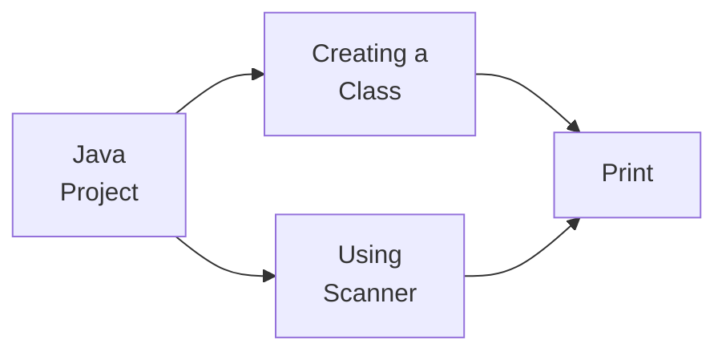

#### Java Project: Simulating a simple Bank Account 
This Porject is part of a [Bootcamp](https://www.dio.me/bootcamp/coding-the-future-claro-java-spring-boot?ref=CG&utm_medium=cpc&utm_source=google&utm_campaign=coding-the-future-claro-java-spring-boot&utm_term=pmax&utm_content=curso-java&gad_source=1&gclid=Cj0KCQjw8MG1BhCoARIsAHxSiQkPgUV5gTXPvjB-JnAUtRrGwNsh6cxS4iNziSguZ-koY45GCAdwj0QaApM9EALw_wcB) made by DIO associated with Claro. Here I'm going to make a simple simulation of a banking account using Java.
#### Challenges 
The Project is simple, I need the user to give me some information to create a bank account.

